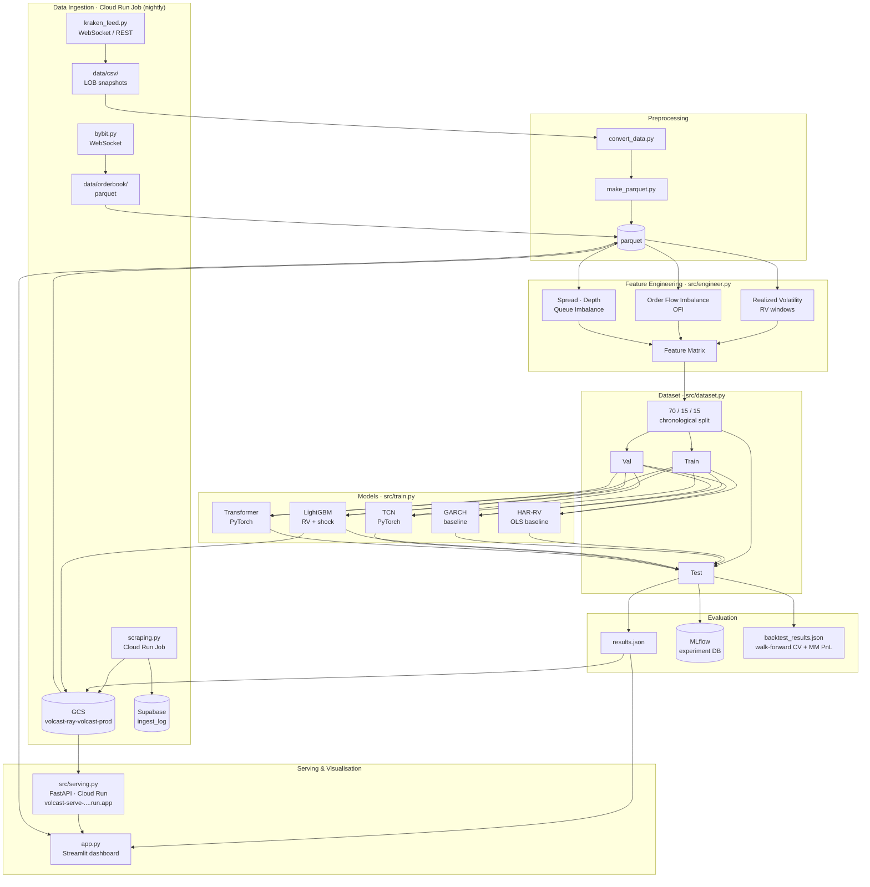

# Volatility & Liquidity Forecasting from Limit Order Book Data

An end-to-end market microstructure research pipeline for forecasting short-horizon realized volatility and liquidity shocks using Level-2 (L2) limit order book data. Built on 5.5M rows of BTC/USD tick data with 5 LOB levels.

## What it does

- **Regression**: forecasts forward realized volatility at 1s, 5s, and 30s horizons
- **Classification**: detects liquidity shocks — bid-ask spread expansions and depth depletions
- **Live feed**: streams real-time LOB snapshots from Kraken/Bybit WebSocket APIs
- **Dashboard**: Streamlit app with feature analysis, model comparison, and live inference
- **Cloud serving**: FastAPI inference API on Cloud Run (scale-to-zero); nightly ingest job on Cloud Run Jobs

## Models

| Model | Type | Notes |
|---|---|---|
| HAR-RV | Econometric baseline | Heterogeneous autoregressive realized volatility |
| GARCH | Econometric baseline | Volatility clustering baseline |
| LightGBM | ML | Regression (RV) + classification (shock) |
| TCN | Deep learning | Temporal Convolutional Network, PyTorch |
| Transformer | Deep learning | Self-attention sequence model, PyTorch |

## Results (5s horizon)

| Model | RMSE | AUROC |
|---|---|---|
| HAR-RV | 6.99e-05 | — |
| GARCH | 7.80e-05 | — |
| LightGBM | 6.70e-05 | 0.843 |

*TCN and Transformer metrics populated after running `evaluate_deep.py`.*

## Architecture



## Project structure

```
├── app.py                      # Streamlit dashboard (entry point)
├── src/
│   ├── config.py               # PipelineConfig (horizons, fractions, LOB levels)
│   ├── engineer.py             # Feature engineering (RV, OFI, spread, depth, HAR lags)
│   ├── dataset.py              # Train/val/test splits (70/15/15 chronological)
│   ├── models.py               # LightGBM wrapper + DataLoader
│   ├── deep_models.py          # TCN and Transformer (PyTorch)
│   ├── train.py                # Full training pipeline + MLflow logging + GCS upload
│   ├── backtest.py             # Walk-forward backtest + market-making PnL simulation
│   ├── evaluate_deep.py        # Post-hoc evaluation of saved deep model pkl files
│   ├── serving.py              # FastAPI inference server (Cloud Run / local :8000)
│   ├── scraping.py             # Cloud Run Job: scrape, upload parquet to GCS, log to Supabase
│   ├── kraken_feed.py          # Kraken WebSocket live feed
│   ├── bybit.py                # Bybit WebSocket live feed
│   ├── make_parquet.py         # Convert raw CSVs to parquet
│   └── convert_data.py         # Data format utilities
├── deploy/
│   ├── cloudrun_job.yaml       # Cloud Run Job spec (nightly ingest)
│   ├── cloudrun_serve.yaml     # Cloud Run Service spec (FastAPI, scale-to-zero)
│   ├── cloudbuild.yaml         # Cloud Build: training job image
│   ├── cloudbuild_serve.yaml   # Cloud Build: serving image
│   ├── supabase_schema.sql     # Supabase ingest_log table DDL
│   └── scheduler.sh            # Cloud Scheduler setup script
├── .github/workflows/
│   ├── deploy_job.yml          # CI: push ingest job image on merge
│   └── deploy_serve.yml        # CI: push serving image on merge
├── Dockerfile                  # Full training image
├── Dockerfile.job              # Ingest job image (no torch)
├── Dockerfile.serve            # Serving image (no torch)
├── requirements.txt            # Full deps (training + dashboard)
├── requirements.job.txt        # Ingest job deps
├── requirements.serve.txt      # Serving deps (LightGBM + FastAPI only)
├── models/                     # Saved model pkl files (git-ignored; source of truth is GCS)
├── data/orderbook/             # Training data (btcusd_full.parquet, 5.5M rows)
└── results.json                # Evaluation metrics (patched by train.py / evaluate_deep.py)
```

## Quickstart

```bash
python -m venv venv && source venv/bin/activate
pip install -r requirements.txt

# Train all models (uploads lgbm_model_*.pkl + results.json to GCS if GCS_BUCKET is set)
python -m src.train --source parquet --path data/orderbook/btcusd_full.parquet

# Walk-forward backtest (5 folds, 5s horizon) — outputs backtest_results.json
python -m src.backtest --source parquet --path data/orderbook/btcusd_full.parquet

# Evaluate saved deep models without retraining
python -m src.evaluate_deep

# Launch dashboard
streamlit run app.py

# Run inference API locally
uvicorn src.serving:app --host 0.0.0.0 --port 8000
```

## Cloud infrastructure (GCP)

All production workloads run on Google Cloud Platform.

| Component | Service | Notes |
|---|---|---|
| Ingest job | Cloud Run Jobs | Nightly scrape → GCS + Supabase metadata log |
| Training | Cloud Run Jobs | Triggered manually or via Cloud Scheduler |
| Inference API | Cloud Run (scale-to-zero) | `volcast-serve-3988143537.us-central1.run.app` |
| Model storage | GCS `volcast-ray-volcast-prod` | `models/lgbm_model_*.pkl`, `results.json` |
| Metadata | Supabase `ingest_log` | Date, row count, GCS path, status per ingest run |
| CI/CD | GitHub Actions + Workload Identity | Pushes images to GCR, deploys on merge to `main` |

### Model lifecycle

1. `src/train.py` trains LightGBM models and saves `models/lgbm_model_{1s,5s,30s}.pkl` + `results.json`
2. At end of training, all pkl files and `results.json` are uploaded to `gs://volcast-ray-volcast-prod/`
3. At Cloud Run startup, `src/serving.py` downloads only `lgbm_model_*.pkl` files from GCS (deep model pkls are skipped — no torch in the serving image)
```

## Walk-forward backtest

`src/backtest.py` runs expanding-window cross-validation to produce statistically robust out-of-sample metrics. Each fold retrains LightGBM on all available history and predicts the next held-out block, eliminating the optimism bias of a single train/test split.

```
python -m src.backtest --source parquet --path data/... --n-folds 8 --horizon 5
```

Output (example):
```
  Fold    Train    Test       RMSE    AUROC   Sharpe        PnL   Time
  ──────────────────────────────────────────────────────────────────────
  0      22000    5500   3.21e-05   0.8312     1.84     0.0043   12.1s
  1      27500    5500   3.18e-05   0.8290     1.91     0.0051   14.3s
  ...
  MEAN                  3.19e-05   0.8301     1.88     0.0239
  STD                   0.04e-05   0.0019
```

Also outputs a **market-making PnL simulation** per fold — the MM quotes when predicted shock probability is below threshold and sits out otherwise, converting AUROC into a concrete Sharpe ratio.

## Target variables

| Target | Description |
|---|---|
| `target_rv_{h}s` | Forward realized volatility over horizon h |
| `target_log_rv_{h}s` | log(RV + ε) — approximately Gaussian (Andersen et al. 2001) |
| `target_shock_spread_{h}s` | Spread exceeds Q75 within horizon (binary) |
| `target_vol_jump_{h}s` | RV exceeds µ + 2σ of trailing 300-tick window (sharper shock signal) |
| `target_shock_depth_{h}s` | Depth ratio drops below Q25 within horizon (binary) |

## Stack

- **Data**: Polars, PyArrow
- **ML**: LightGBM, PyTorch (MPS/CUDA/CPU)
- **Tracking**: MLflow
- **API**: FastAPI + Uvicorn on Cloud Run
- **Dashboard**: Streamlit
- **Live data**: Kraken & Bybit WebSocket APIs
- **Storage**: GCS (model artifacts + parquet), Supabase (ingest metadata)
- **CI/CD**: GitHub Actions + GCP Workload Identity Federation
- **Containerization**: Docker (3 images: training, ingest job, serving)
