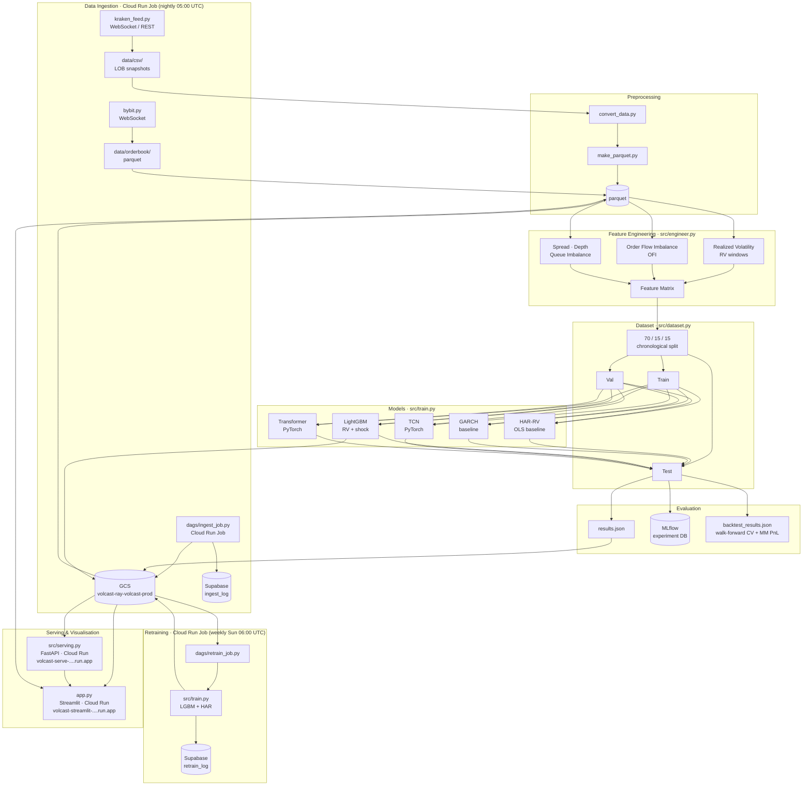

# Volatility & Liquidity Forecasting from Limit Order Book Data

A cloud-native market microstructure research pipeline for forecasting short-horizon realized volatility and liquidity shocks using Level-2 (L2) limit order book data. Built on 5.5M+ rows of BTC/USD tick data with 5 LOB levels.

## What it does

- **Regression**: forecasts forward realized volatility at 1s, 5s, and 30s horizons
- **Classification**: detects liquidity shocks — bid-ask spread expansions and depth depletions
- **Live feed**: streams real-time LOB snapshots from Kraken/Bybit WebSocket APIs
- **Dashboard**: Streamlit app with feature analysis, model comparison, and live inference
- **Cloud serving**: FastAPI inference API + Streamlit dashboard on Cloud Run (scale-to-zero); nightly ingest and weekly retraining on Cloud Run Jobs

## Models

| Model | Type | Notes |
|---|---|---|
| HAR-RV | Econometric baseline | Heterogeneous autoregressive realized volatility |
| GARCH | Econometric baseline | Volatility clustering baseline |
| LightGBM | ML | Regression (RV) + classification (shock) |
| TCN | Deep learning | Temporal Convolutional Network, PyTorch |
| Transformer | Deep learning | Self-attention sequence model, PyTorch |

## Results

### Realized volatility regression (RMSE)

| Model | 1s | 5s | 30s |
|---|---|---|---|
| HAR-RV | 1.23e-04 | 1.15e-04 | 3.67e-04 |
| LightGBM | **6.70e-05** | **1.09e-04** | **1.88e-04** |
| TCN | — | 1.40e-03 | — |
| Transformer | — | 1.25e-04 | — |

### Liquidity shock classification (AUROC / AUPRC)

| Model | 1s | 5s | 30s |
|---|---|---|---|
| LightGBM | 0.943 / 0.880 | 0.843 / 0.795 | 0.808 / 0.916 |
| TCN | — | 0.830 / 0.793 | — |
| Transformer | — | 0.836 / 0.805 | — |

### Feature ablation (5s LGBM, delta RMSE vs baseline 1.09e-04)

| Feature group removed | ΔRMSE |
|---|---|
| RV windows | +8.3e-07 |
| HAR lags | +5.0e-07 |
| Book shape | +4.2e-07 |
| OFI | +1.5e-07 |
| Spread | +1.4e-07 |
| Depth | +1.4e-07 |

## Architecture



## Project structure

```
├── app.py                      # Streamlit dashboard (entry point)
├── dags/
│   ├── ingest_job.py           # Cloud Run Job: nightly scrape → GCS + Supabase
│   └── retrain_job.py          # Cloud Run Job: weekly LGBM + HAR retrain
├── src/
│   ├── config.py               # PipelineConfig (horizons, fractions, LOB levels)
│   ├── engineer.py             # Feature engineering (RV, OFI, spread, depth, HAR lags)
│   ├── dataset.py              # Train/val/test splits (70/15/15 chronological)
│   ├── models.py               # LightGBM wrapper + DataLoader
│   ├── deep_models.py          # TCN and Transformer (PyTorch)
│   ├── train.py                # Full training pipeline + MLflow logging + GCS upload
│   ├── backtest.py             # Walk-forward backtest + market-making PnL simulation
│   ├── evaluate_deep.py        # Post-hoc evaluation of saved deep model pkl files
│   ├── serving.py              # FastAPI inference server (Cloud Run / local :8000)
│   ├── scraping.py             # Cloud Run Job: scrape, upload parquet to GCS, log to Supabase
│   ├── kraken_feed.py          # Kraken WebSocket live feed
│   ├── bybit.py                # Bybit WebSocket live feed
│   ├── make_parquet.py         # Convert raw CSVs to parquet
│   └── convert_data.py         # Data format utilities
├── deploy/
│   ├── cloudrun_job.yaml         # Cloud Run Job spec (nightly ingest)
│   ├── cloudrun_retrain.yaml     # Cloud Run Job spec (weekly retraining)
│   ├── cloudrun_serve.yaml       # Cloud Run Service spec (FastAPI, scale-to-zero)
│   ├── cloudrun_streamlit.yaml   # Cloud Run Service spec (Streamlit dashboard)
│   ├── cloudbuild.yaml           # Cloud Build: ingest job image
│   ├── cloudbuild_serve.yaml     # Cloud Build: serving image
│   ├── cloudbuild_streamlit.yaml # Cloud Build: Streamlit dashboard image
│   ├── supabase_schema.sql       # Supabase DDL (ingest_log + retrain_log)
│   └── scheduler.sh              # Cloud Scheduler setup script
├── .github/workflows/
│   ├── deploy_job.yml          # CI: push ingest job image on merge
│   └── deploy_serve.yml        # CI: push serving image on merge
├── Dockerfile                  # Full training image
├── Dockerfile.job              # Ingest job image (no torch)
├── Dockerfile.serve            # Serving image (no torch)
├── requirements.txt            # Full deps (training + dashboard)
├── requirements.job.txt        # Ingest job deps
├── requirements.serve.txt      # Serving deps (LightGBM + FastAPI only)
├── models/                     # Saved model pkl files (git-ignored; source of truth is GCS)
├── data/orderbook/             # Training data (btcusd_full.parquet, 5.5M rows)
└── results.json                # Evaluation metrics (patched by train.py / evaluate_deep.py)
```

## Quickstart

```bash
python -m venv venv && source venv/bin/activate
pip install -r requirements.txt

# Train all models (uploads lgbm_model_*.pkl + results.json to GCS if GCS_BUCKET is set)
python -m src.train --source parquet --path data/orderbook/btcusd_full.parquet

# Walk-forward backtest (5 folds, 5s horizon) — outputs backtest_results.json
python -m src.backtest --source parquet --path data/orderbook/btcusd_full.parquet

# Evaluate saved deep models without retraining
python -m src.evaluate_deep

# Launch dashboard
streamlit run app.py

# Run inference API locally
uvicorn src.serving:app --host 0.0.0.0 --port 8000
```

## Cloud infrastructure (GCP)

All production workloads run on Google Cloud Platform.

| Component | Service | Notes |
|---|---|---|
| Ingest job | Cloud Run Jobs | Nightly 05:00 UTC — scrape → GCS + `ingest_log` |
| Retrain job | Cloud Run Jobs | Weekly Sun 06:00 UTC — LGBM + HAR on rolling 7-day window → GCS + `retrain_log` |
| Inference API | Cloud Run (scale-to-zero) | `volcast-serve-3988143537.us-central1.run.app` |
| Dashboard | Cloud Run (scale-to-zero) | `volcast-streamlit-3988143537.us-central1.run.app` |
| Model storage | GCS `volcast-ray-volcast-prod` | `models/lgbm_model_*.pkl`, `results.json` (7-day lifecycle) |
| Metadata | Supabase | `ingest_log` (per-day ingest status) + `retrain_log` (per-run retrain metrics) |
| CI/CD | GitHub Actions + Workload Identity | Pushes images to GCR, deploys on merge to `main` |

### Model lifecycle

1. `dags/retrain_job.py` downloads all available `orderbook/*.parquet` files from GCS (up to 7 days)
2. `src/train.py` retrains LGBM + HAR, saves `models/lgbm_model_{1s,5s,30s}.pkl` + `results.json`, and uploads them to GCS
3. At Cloud Run startup, `src/serving.py` downloads only `lgbm_model_*.pkl` from GCS (TCN/Transformer skipped — no torch in the serving image)
4. TCN and Transformer are retrained manually on Kaggle (GPU required) and uploaded to GCS separately

## Stack

- **Data**: Polars, PyArrow
- **ML**: LightGBM, PyTorch (MPS/CUDA/CPU)
- **Tracking**: MLflow
- **API**: FastAPI + Uvicorn on Cloud Run
- **Dashboard**: Streamlit
- **Live data**: Kraken & Bybit WebSocket APIs
- **Storage**: GCS (model artifacts + parquet), Supabase (ingest metadata)
- **CI/CD**: GitHub Actions + GCP Workload Identity Federation
- **Containerization**: Docker (3 images: training, ingest job, serving)